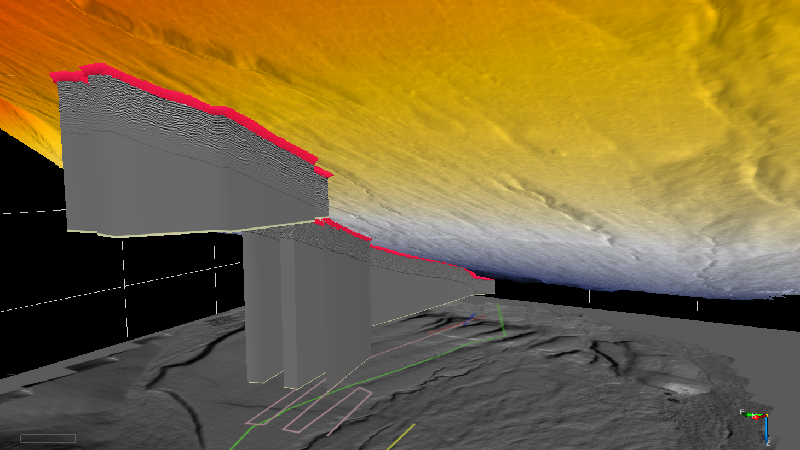

3D Interpretation
==================
Once the signal to noise ratio is optimized in individual traces it is time to import the data in a corresponding interpretation software. Here, we will be using OpenDetect. You can get the academic license for free and it does a fairly good job at 3D visualization. 
The best way to export the data is to use standardized formats such as SEGY. However, these formats are somtimes cumbersome to write and here we go for a simpler version using ASCII text Files:

.. code-block:: python

    OutfileString = f'{PathToMat[:-4]}.txt'
    print(f'Writing the file to:{OutfileString}')
    Out = np.vstack((x,y,TopoArray))
    print(f'Outputfile has shape {Out.shape}')
    print(f'Depth spacing is {dz} meters.')
    np.savetxt(OutfileString,Out.T)

.. image:: images/OpenDTect.gif
  :width: 750
  :alt: 3D Analysis