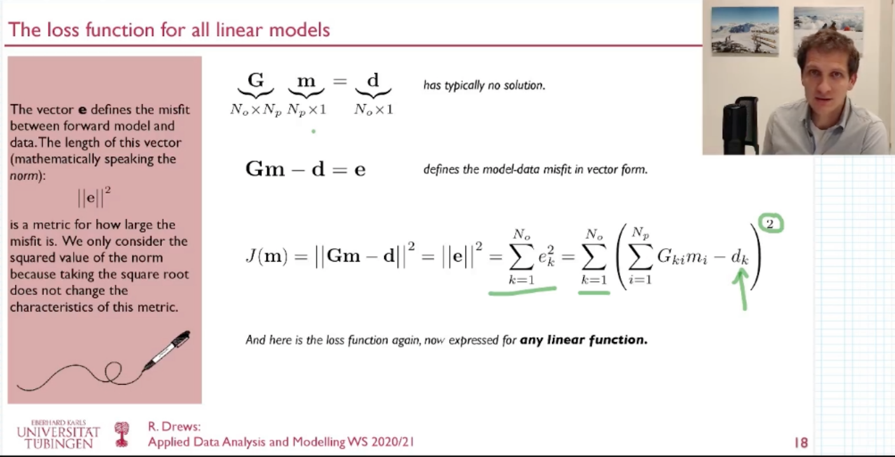
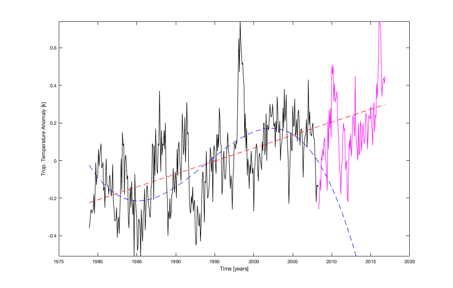

======================
Linear Least Squares
======================
The key concept to understand is that all linear problems can be written using a matrix representation:

.. math::
    \underbrace{\mathbf{G}}_{N_o \times N_p}\underbrace{\mathbf{m}}_{N_p \times 1} = \underbrace{\mathbf{d}}_{N_o \times 1}

where the the vector **d** represents the observations, the vector **m** represents the unknown model parameters and the matrix **G** specifies the forward model. There are many geo- and environmental examples where this applied including all polynomial fitting problems and also some aspects of deconvolution which we treat in the exercises. The goal is always to find an optimal set of model parameters that approximates the observations in a least-squares sensed meaning that:

.. math::
    LF(\mathbf{m}) = ||\mathbf{G}\mathbf{m} - \mathbf{d}||^2 = \sum_{k=1}^{N_o}(\sum_{i=1}^{N_p}G_{ki}m_i - d_k)^2 \rightarrow \text{small}

This term quantifies in a least-squares sense how good the model for a given set of model parameter approximates the observations. It has many names (loss function, objective function, cost function,..). For a concrete example have a look at this `Video <https://youtu.be/oGFza4LdwSc>`_:   

In order to find the optimal set of model parameters the loss function needs to be minimized which in the linear case leads to the normal equation. This is spelled out in this `Video <https://youtu.be/oGFza4LdwSc>`_:  

.. image:: img/VideoCostFunction2.png
  :width: 700
  :target: https://youtu.be/_pIZTjtHkb
  :alt: Minimizing the cost function

..  .. image:: img/VideoCostFunction2.png
..   :width: 700
..   :alt: Video introduction the cost function

Polynomial Curve Fitting
------------------------
Polynomial curve fitting (linear regression being the most prominent example) belongs to the class of overdetermined linear inverse problems which can be solved using the normal equation. In the exercises in class we investigate this adventurous fitting and the even more adventurous predictions of this fit: 

.. image:: img/AustralianTropoT.png
  :width: 700
  :alt: Adventurous fitting

In our analysis we show that a linear fit provides much more robust predictions to whatever is indicated in the newspaper article:

Here is a function which applies the normal equation to the curve fitting problem:

.. code-block:: matlab

    function [coefficients] = LstSqrFit1D(auxvar,data,order)
      %This is a routine for least square fitting of polynomials with
      %order n (i.e. n=1 is straight line)
      %Auxvar is the auxilary variable (i.e. x-values)
      %Data is the data variable (i.e. y-axis)
      %Auxvar, Data must have same size.
      %The function returns the coefficients of the polynomial.

      %check if auxvar is column vector
      [row, col] = size(auxvar);
      if (row<col)
          auxvar = auxvar';
          data = data';
      end
      %setup G matrix
      NumberOfDataPoints = length(auxvar);
      G=zeros(NumberOfDataPoints,order+1);
      for k = 1:order+1
          G(:,k) = auxvar.^(order-k+1);
      end
      display(num2str(cond(G)))
      %%Naive Lsq inversion (works for small orders)
      %coefficients = inv(G'*G)*G'*data;
      %Lsq inversion that can deal better with poor-conditioning
      %(python equivalent is numpy.linalg.lstsq)
      %coefficients = (G'*G)\(G'*data);

      %Diagonal Loading can stabilize this system.

      coefficients = (G'*G+0.0001*eye(order+1,order+1))\(G'*data);
    end

And this is how you can run it:

.. code-block:: matlab

    % Year Month GlobalTemperature + ...
    indtmp = load('InputData/UAH_Monthly_Global_Lower_Troposphere_Anomalies6_5_UntilApril2008.nh.txt');
    indtmp_full = load('InputData/UAH_Monthly_Global_Lower_Troposphere_Anomalies6_5.nh.txt');
        %Time in decimal years
        xd = indtmp(:,1)+(indtmp(:,2)-1)/12.0;
        xdf = indtmp_full(:,1)+(indtmp_full(:,2)-1)/12.0;
        %Global Temperatures in Troposphere
        yd = indtmp(:,3);
        ydf = indtmp_full(:,3);
        %This is a function doing (naive) LSQ inversion for various orders.
        coeff1 = LstSqrFit1DReg(xd,yd,1,0.0);
        %This will be ill-conditioned
        %coeff6 = LstSqrFit1D(xd,yd,6);
        coeff6 = LstSqrFit1DReg(xd,yd,6,0.001);
        %This is matlab magic (in python try: numpy.linalg.lstsq)
        coeff6_polyfit = polyfit(xd,yd,6);
        figure(1)
        %polyval is a little helper function to plot polynomials
        %of varying degree.
        plot(xd,yd,'k-'); hold on;
        %plot(xdf,polyval(coeff1,xdf),'r--');
        plot(xdf,polyval(coeff1,xdf),'r--');
        plot(xdf,polyval(coeff6,xdf),'b--');
        inds = find((xdf>xd(end))==1);
        plot(xdf(inds),ydf(inds),'m-');
        ylim([min(yd),max(yd)])