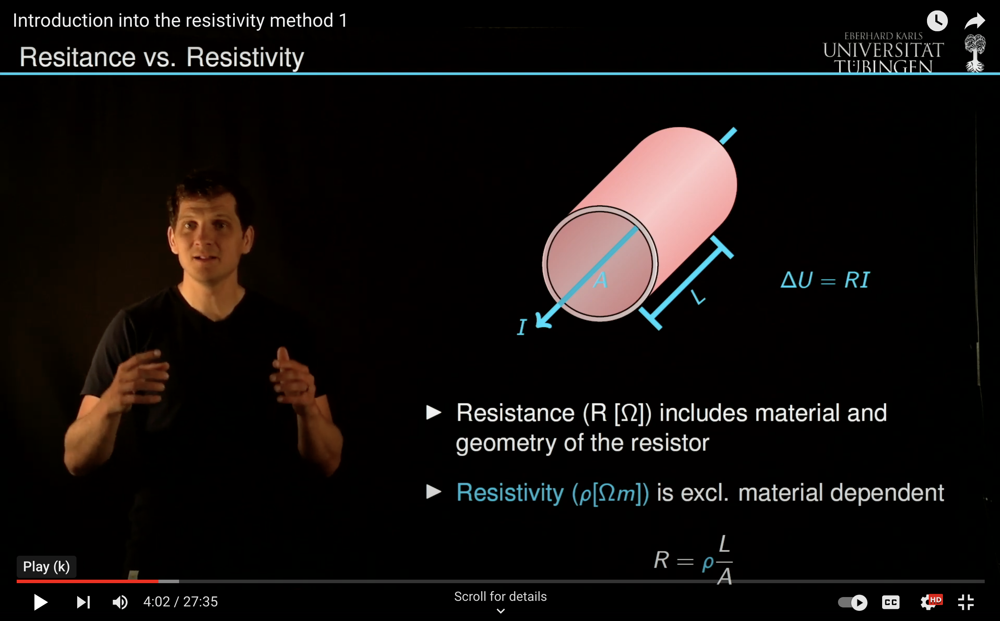

=======================================
Introduction to resistivity mapping
=======================================
A good introduction to resistivity mapping is given by `Binley and Slater <https://doi.org/10.1017/9781108685955>`_ accessible as a online resource from the library. In the video below I summarized some essentials from an applied perspective:

An important and educational example are principles of vertical electrical sounding which provides us with a forward model that can be handled using standard computers.

.. image:: ./img/Resistivity2.png
  :width: 700
  :target: https://www.youtube.com/watch?v=l2-sxg65KUE
  :alt: Introducing the resistivity method 2

..  .. image:: img/VideoCostFunction2.png
..   :width: 700
..   :alt: Video introduction the cost function

Vertical electrical sounding
-----------------------------
Twin experiment

.. literalinclude:: ../../../Resistivity/VES/VES_InversionTwinExperiment.py
   :language: python
   :emphasize-lines: 3,6-8
   :linenos:

